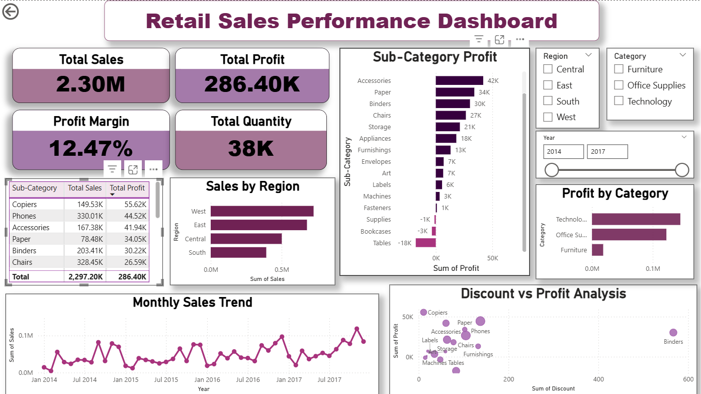

# 🛒 Retail Sales Performance Dashboard | SQL + Power BI

An end-to-end Business Intelligence project analyzing retail sales data using SQL for data exploration and Power BI for interactive dashboard creation — tracking $2.30M in sales across regions, categories, and sub-categories.

---

## 📊 Dashboard Preview



---

## 🔍 Project Overview

This project performs a complete retail sales analysis on the Superstore dataset (~10,000 rows) using SQL queries for data extraction and Power BI for visualization. The interactive dashboard enables business stakeholders to explore sales performance, profitability, and discount impact across multiple dimensions.

---

## 🚀 Key Insights

- 📦 **Total Sales:** $2.30M across 4 years (2014–2017)
- 💰 **Total Profit:** $286.40K with a **12.47% Profit Margin**
- 📊 **Total Quantity Sold:** 38K units
- 🏆 **Best performing region:** West ($0.5M+ in sales)
- ⚠️ **Critical finding:** Tables sub-category showed **–$18K profit** despite high sales — revealing a severe discounting issue
- 📈 **Most profitable sub-category:** Copiers ($55.62K profit)
- 🖥️ **Most profitable category:** Technology

---

## 🛠️ Tech Stack

| Category | Tools |
|---|---|
| Language | SQL (MySQL) |
| BI & Visualization | Power BI |
| Dataset | Sample Superstore (~10,000 rows) |

---

## 📁 Project Structure

```
Retail-Sales-BI-Dashboard/
│
├── r_s.pbix                    # Power BI dashboard file
├── Retails_sales_anal.sql      # SQL queries for data analysis
├── Sample_-_Superstore.csv     # Dataset
├── R_SPWBI.png                 # Dashboard screenshot
└── README.md
```

---

## 🗃️ SQL Analysis

8 SQL queries were written to extract key business insights:

| Query | Description |
|---|---|
| Total Sales | Overall revenue calculation |
| Total Profit | Overall profit calculation |
| Sales by Region | Revenue breakdown by region |
| Profit by Category | Profitability across Furniture, Office Supplies, Technology |
| Top 10 Products | Best selling products by revenue |
| Monthly Sales Trend | Month-over-month revenue trends |
| Top Sub-Categories | Most and least profitable sub-categories |
| Discount Impact | Relationship between discount rates and average profit |

---

## 📈 Dashboard Features

- 📌 **4 KPI Cards** — Total Sales, Total Profit, Profit Margin, Total Quantity
- 📊 **Sub-Category Profit Bar Chart** — ranked from most to least profitable
- 🗺️ **Sales by Region Bar Chart** — West, East, Central, South comparison
- 📉 **Monthly Sales Trend Line Chart** — 2014–2017 time series
- 💹 **Profit by Category Bar Chart** — Technology vs Office Supplies vs Furniture
- 🔵 **Discount vs Profit Scatter Plot** — reveals heavy discounting hurts profit
- 📋 **Sub-Category Table** — Total Sales and Total Profit per sub-category
- 🎛️ **Interactive Filters** — Region, Category, Year range slicer

---

## 📌 How to Open the Dashboard

1. Download `r_s.pbix`
2. Open with **Microsoft Power BI Desktop** (free download at powerbi.microsoft.com)
3. The dashboard is fully interactive — use the Region, Category, and Year filters

---

## 🙋 Author

**Tilna Kuriakose**
- GitHub: [@Tilna](https://github.com/Tilna)

---

